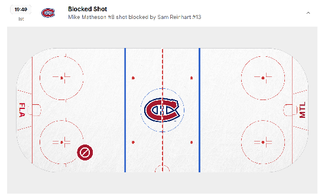
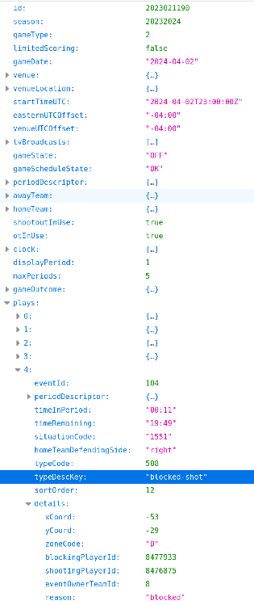
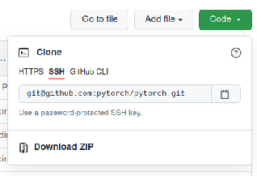
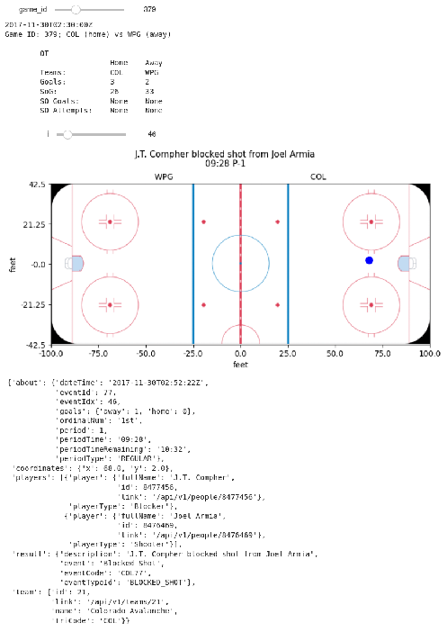
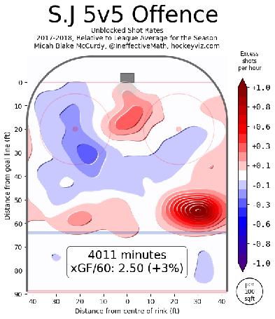
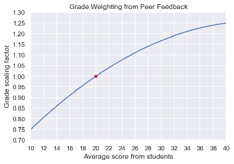

# IFT 6758 Project: Milestone 1

Released: 15 September 2025  
Due date: 15 October 2025

The goal of this milestone is to give you experience with the [data wrangling](https://en.wikipedia.org/wiki/Data_wrangling) and [exploratory data analysis](https://en.wikipedia.org/wiki/Exploratory_data_analysis) phases of a data science project, which are often where you will spend most of your time during a data science project. You will gain experience with some of the common tools used to retrieve and manipulate data, as well as build confidence in creating tools and visualisations to help you understand the data prior to jumping into more advanced modelling. 

Broadly, the outline for this milestone is to use [NHL stats API](https://gitlab.com/dword4/nhlapi/-/blob/master/new-api.md) to retrieve “play-by-play” data for a specific time period and to generate plots. You will clean the play-by-play data, then create simple and interactive visualisations from it. There will be a small number of simple qualitative questions to answer throughout the tasks that will relate to the tasks outlined. Finally, you will present your work in the form of a simple static web page, created using [Jekyll](https://jekyllrb.com/).

**[IFT6758 only]** You will also explore how to use LLM-based tools to streamline some components of the pipeline, for example, how to augment your LLM with Retrieval-Augmented Generation (RAG) to make it easier to understand the documentation or to create simple visualisations and summaries of the data. The general approach is to use LLM+RAG to simplify parts of the pipeline; for example, provide the LLM with the API documentation and ask it to write a Python function to download, save the data to disk, and load it into computer memory.  
   
**Note: the work you do in this milestone will be useful for future milestones, so make sure your code is clean and reusable \- your future self will thank you for it\!**

> [!NOTE]
> **IFT3700 vs IFT6758.** Both courses complete the same milestone, except for the LLM/RAG components, which are **required for IFT6758 only**. Every such part is marked **[IFT6758 only]**; IFT3700 students can skip them.

- [A note on Plagiarism](#a-note-on-plagiarism)
- [NHL data](#nhl-data)
  - [Motivation](#motivation)
- [Learning Objectives](#learning-objectives)
- [Deliverables](#deliverables)
  - [Submission Details](#submission-details)
- [LLM setup (IFT6758 only)](#llm-setup-ift6758-only)
  - [Required model](#required-model)
  - [Suggested Environment: Google Colab T4](#suggested-environment-google-colab-t4)
  - [Optional Execution Paths](#optional-execution-paths)
  - [Reproducibility Considerations](#reproducibility-considerations)
- [Tasks and Questions](#tasks-and-questions)
  - [0\. Blog Post](#0-blog-post)
  - [1\. Data Acquisition (25%)](#1-data-acquisition-25)
  - [2\. Interactive Debugging Tool (10%)](#2-interactive-debugging-tool-10)
  - [3\. Tidy Data (10%)](#3-tidy-data-10)
  - [4\. Simple Visualisations (25%)](#4-simple-visualisations-25)
  - [5\. Advanced Visualisations: Shot Maps (30%)](#5-advanced-visualisations-shot-maps-30)
- [Group Evaluations](#group-evaluations)
  - [How scores impact your grade](#how-scores-impact-your-grade)
- [Useful References](#useful-references)

## A note on Plagiarism

For the LLM comparisons below (IFT6758 only), “manual implementation” means code written by your team without LLM-generated code. Disclose any AI assistance; your team remains responsible for explaining and validating all submitted code.

Using code/templates from online resources is acceptable and it is common in data science, but be clear to cite exactly where you took code from when necessary. A simple one line snippet which covers some simple syntax from a StackOverflow post or package documentation probably doesn’t warrant citation, but copying a function which does a bunch of logic that creates your figure does. We trust that you can use your best judgement in these cases, but if you have any doubts you can always just cite something to be safe. We will run some plagiarism detection on your code and deliverables, and it is better to be safe than sorry by citing your references.

Integrity is an important expectation of this course project and any suspected cases will be pursued in accordance with Université de Montréal’s very [strict policy](https://integrite.umontreal.ca/reglements/les-reglements-expliques/). The full text of the university-wide regulations can be found [here](https://secretariatgeneral.umontreal.ca/public/secretariatgeneral/documents/doc_officiels/reglements/enseignement/ens30_12-reglement-disciplinaire-plagiat-fraude-etudiants-cycles-superieurs.pdf). It is the *responsibility of the team* to ensure that this is followed rigorously and action can be taken on individuals or the entire team depending on the case.

## NHL data

The subject matter for this project is hockey data, specifically the NHL stats API. This data is very rich; it contains information from many years into the past ranging from metadata about the season itself (eg. how many games were played), to season standings, to player stats per season, to fine-grained event data for every game played, known **play-by-play data**. If you’re unfamiliar with play-by-play data, the NHL uses this exact data to generate their play-by-play visualisations, an example of which is shown below. For a single game, roughly 200-300 events are tracked, typically limited in scope to faceoffs, shots, goals, saves, and hits (no passes or individual player location). Note that there is a logical way the games are assigned a unique ID, which is described [here](https://gitlab.com/dword4/nhlapi/-/blob/master/stats-api.md#game-ids) (take care to note the difference between regular season and playoff games\!).  
  
*Figure 1: Sample play-by-play data for game* **2023021190** *at the beginning of the 1st period*. *Each event contains an identifier (e.g. “FACEOFF”, “SHOT”, etc.), a description of the event, the players involved, as well as the location of this event on the ice (drawn on the ice rink to the far right). The raw event data contains more information than this. You can explore this game’s play-by-play [**here**](https://www.nhl.com/gamecenter/fla-vs-mtl/2024/04/02/2023021190/playbyplay).*

The time of event, event type, location, players involved, and other information is recorded for each event and the raw data is accessible through the play-by-play API.   
For example, the raw data for the above play-by-play can be found here:  
[https://api-web.nhle.com/v1/gamecenter/**{GAME\_ID}**/play-by-play](https://api-web.nhle.com/v1/gamecenter/2022030411/play-by-play)  
E.g. for the game **2022030411** can be found here:   
[https://api-web.nhle.com/v1/gamecenter/**2022030411**/play-by-play](https://api-web.nhle.com/v1/gamecenter/2022030411/play-by-play)

A snippet of the raw event data can be seen in Figure 2\. You will need to explore the data and read the API docs to figure out exactly what you will need.  
  
*Figure 2: Raw JSON data obtained from the NHL stats API for the same events in Figure 1\. Note that there are other events between the desired ones \- that will be up for you to explore\!*  
**Some notes/caveats on the API:**

* The API was changed in the 2023-24 season; as such, the detailed [unofficial API document](https://gitlab.com/dword4/nhlapi/-/blob/master/stats-api.md) is unfortunately mostly outdated and cannot be used. Similarly, lots of community documentation (e.g. on reddit, blog posts) are also outdated and will not work.  
* There are some new community API docs available, but they are less detailed/complete than the old API’s unofficial doc. They can be found here:  
  * [Zmalski's  NHL API Reference](https://github.com/Zmalski/NHL-API-Reference)   
  * [dword4's NHL API Doc](https://gitlab.com/dword4/nhlapi/-/blob/master/new-api.md)   
* On a more positive note, the interface seems to be cleaner and more detailed (i.e. more notes on play information, more event types such as missed/blocked shots with coordinates, etc). While figuring out the API might be a bit more challenging, using the data should be much easier. 

### Motivation

While we understand some people may not be sports fans, we think this is an exciting dataset to work with for a number reasons:

1. It is a real-world dataset that is used by professional data scientists, some of which are employed by the NHL teams themselves, and others run their own analytics businesses.  
2. During the hockey season, data is updated live as games are in progress\! This gives the opportunity to interact with new data frequently, giving you some insight as to why “pipelining”, and writing clean and reusable code is critical in a successful data science workflow.  
3. It is very rich, as discussed above.  
4. It is “clean” in the sense that the API is consistent and you will not have to deal with parsing or cleaning nonsensical data.   
5. It is “messy” in the sense that all of the raw data is in JSON, and not immediately suitable for use in a data science workflow. You will need to “tidy” the data into a usable format, which is a significant portion of many data science projects. Because the data already comes in a consistent format, we think this is a good balance between giving you some work to do to clean the data, while not being unreasonable.  
6. Hockey is often a great conversation facilitator here in Canada (and especially Montreal). If you’re new to Canada, this is a great way to learn a little bit about our culture :)

Even if you are not a hockey fan, we hope that you will find this project experience interesting and educational. We think that playing with real-world data is more rewarding and far more representative of the data science workflow than working with prepared datasets such as those available on Kaggle. If you are particularly proud of your project, some of the deliverables will teach you how to host your content in a publicly accessible way (via Github pages), which can help you in your future internship or job hunts\!

## Learning Objectives

* **Data acquisition and cleaning**   
  * Understand what a REST API is  
  * Programmatically downloading data from the internet using Python  
  * Format the raw data into useful tables of data  
  * Get familiar with the idea of “pipelining” your work; i.e. creating logically separated components such as:  
    * Downloading and saving data   
    * Load raw data  
    * Process raw data into some format  
* **Data exploration**  
  * Explore the raw data and understand what it looks like  
  * Build simple interactive tools to help you work with the data more efficiently  
* **Visualisation and Exploratory Data Science**  
  * Gain some intuition and answer some simple questions about the data by looking at visualisations  
  * Use Matplotlib or Seaborn or Plotly to create nice figures  
  * Create interactive figures to communicate your results more effectively   
* **LLM and RAG Integration [IFT6758 only]**  
  * Leverage RAG over API documentation to accelerate API exploration and data acquisition.   
  * Implement LLM-assisted code generation for pipeline tasks (fetching, caching, loading) and evaluate model accuracy against manually written code.   
  * Explore natural language data querying and automated visualisation using frameworks like PandasAI.

## Deliverables

Template Repos to work off of:

- [Blog post template](https://github.com/milarobotlearningcourse/data_science_blog)  
- [Project template](https://github.com/milarobotlearningcourse/data_science_project)

You must submit **BOTH**: 

1. Blog post style report  
2. Your team’s codebase **that is reproducible**; i.e. all of the figures can be regenerated easily.

Instead of a traditional report written in LaTeX, you will be asked to submit a blog post which will contain discussion points and (interactive\!) figures. We will provide a template and instructions by 16 September 2024, so don’t worry about having to figure it all out by yourself. At a high level, you will use [Jekyll](https://jekyllrb.com/) to create a static web page from [Markdown](https://github.com/adam-p/markdown-here/wiki/Markdown-Cheatsheet). This is a very simple way to create nice looking pages, and could be very useful for you to create blog posts in the future if you are interested, or wish to buff up your resume in a job hunt. Although we will not be deploying these pages to the public[^1], [it is very simple to use github pages to publish your content.](https://docs.github.com/en/pages/setting-up-a-github-pages-site-with-jekyll) You’re more than welcome to do this at the end of the course\!

### Submission Details

To submit your project, you must:

- [ ] Publish your final milestone submission to the  **master** or **main** branch   
      (You must do this first before downloading the ZIPs\!)  
- [ ] Submit a ZIP of your blog post to [gradescope](https://www.gradescope.com/courses/286503/assignments/1499833)  
- [ ] Submit a ZIP of your codebase to [gradescope](https://www.gradescope.com/courses/286503/assignments/1499846)  
- [ ] Add the IFT6758 TA github account (**`to be released`**)  to your git repo as a *viewer*

**Note**: Only one person per team needs to submit the project to Gradescope.  
To submit a ZIP of your repository, you can download it via the Github UI:  
  
Remember that this method does not download the whole git repo, just the master or main branch. Make sure all of your code is committed to the master branch before downloading the ZIPs.

## LLM setup (IFT6758 only)

> [!NOTE]
> This whole section applies to IFT6758 only. IFT3700 students can skip ahead to [Tasks and Questions](#tasks-and-questions).

### Required model

For all LLM-based tasks in this milestone, you must use **Qwen3-4B-Instruct-2507** (Qwen/Qwen3-4B-Instruct-2507). The model download and loading configuration will be provided through the GitHub project template. Refer to the [official model card and usage documentation](https://huggingface.co/Qwen/Qwen3-4B-Instruct-2507) for instructions on using the model.

This checkpoint is non-thinking, so no thinking-mode configuration is required.

### Suggested Environment: Google Colab T4

We suggest utilising **Hugging Face Transformers running FP16 inference via a Google Colab T4 GPU (16 GB VRAM)**. Ensure your Colab instance is configured with GPU hardware acceleration and verify that your assigned device is indeed a T4 GPU.

The raw model weights are formatted in **BF16** (16-bit floating point precision). Within the provided project repository, these weights are loaded using FP16 mode via dtype=torch.float16. Since both options utilise 16-bit floating-point representations, this casting step does not constitute reduced-precision quantisation. **Applying quantisation steps is completely unnecessary for this workflow.**

Initialising the network requires roughly **7.7 GB of VRAM**, maintaining an execution speed around **6 generated tokens per second**. Keep in mind these metrics are simply informative baselines rather than strict guarantees: total memory footprint and throughput vary depending on sequence context lengths and overall system environment parameters. Note that generation steps require extra GPU memory overhead.

### Optional Execution Paths

The recommended execution stack provides everything necessary to complete the assignment. **Exploring specialised quantisation or inference engines remains completely optional and unassessed; no bonus points will be awarded for achieving faster execution rates or implementing complex deployment frameworks.** Regardless of the framework choice, you must utilise the designated **Qwen3-4B-Instruct-2507** weight checkpoint.

**Custom Hardware Execution.** You are free to run the code on local dedicated GPUs or Apple Silicon machines provided your hardware handles the execution requirements.

**Model Quantisation.** Should you wish to decrease memory utilisation, you can test 8-bit quantisation through Hugging Face tools alongside the [bitsandbytes](https://huggingface.co/docs/transformers/quantization/bitsandbytes) library using BitsAndBytesConfig(load\_in\_8bit=True). This applies **INT8** low-bit precision. Building custom quantisation algorithms is not expected. Keep in mind that low-bit precision reduces memory usage but does not guarantee faster token output.

**Custom Inference Engines.** You can also explore specialised engines like [llama.cpp](https://qwen.readthedocs.io/en/latest/run_locally/llama.cpp.html) paired with an 8-bit GGUF conversion of the exact same weights to evaluate potential speed benefits on local setups.

### Reproducibility Considerations

Regardless of your hardware and software setup, carefully outline your execution environment, library versions, precision settings, quantisation formats, and generation hyperparameters to ensure your pipeline and results remain fully reproducible.

## Tasks and Questions

The tasks required for milestone 1 are outlined here. The overall description of what is required is described at the beginning of each task. The **Questions** section of each task will outline content that is required in the blog post. This may either be interpretation questions, or you may have to produce figures or images to include in the blog post. We try to write most of the things that are required in the report in **bold**, but make sure you answer everything asked of you in each question. We do not expect long responses for the questions, in most cases a few sentences will suffice. 

### 0\. Blog Post

Create a blog post using the provided template containing all of the required figures, answers, and discussion mentioned in the previous section. You will not need to actually deploy the blogpost so that it’s publicly accessible, but instructions will be provided for how to do this if you would like to show off your awesome project on your resume after the course is done\! 

**You MUST submit this in a blog post format\!**

We suggest getting started getting a working environment for the blog post early on, as it will be much easier to answer questions and add figures in the blog post as you are working on the project, rather than trying to get this set up right before the deadline\! Once your environment is up and running it’s very simple to work with\!

### 1\. Data Acquisition (25%)

Create a function or class to download NHL play-by-play data for both the regular season and playoffs. The primary endpoint of interest is:

https://api-web.nhle.com/v1/gamecenter/**\[GAME\_ID\]**/play-by-play

You will need to read the [**OLD** unofficial API doc](https://gitlab.com/dword4/nhlapi/-/blob/master/stats-api.md#game-ids) to understand how **GAME\_ID** is formed. You could open up the endpoint in your browser to check out the raw JSON to explore it a little bit (Firefox has a nice built-in JSON viewer). ***Note that this document is generally out of date as the NHL moved to a new API in the 2023-24 season, however the game ID is still formed in the same way\!***

Use your tool to download data from the 2016-17 season all the way up to the 2023-24 season. You can implement this however you wish, but if you need guidance here are some tips:

* This is a public API, and as such you must be mindful that someone else is paying for the requests. You should download the raw data and save it locally, and then use this local copy to derive tidy/usable datasets from it.   
    
* **Do not** commit the data (or large binary blobs) to your GitHub repo. This is bad practice, git is for code, not file storage. While it may be possible for the dataset you will be working with, it likely won’t be when you work on larger-scale projects in industry or academia. Larger git repos become slow to clone and work with. Note that because of the way git works, once you commit and push a file, simply removing it and committing the deletion won’t actually delete the file; you’ll need to actually rewrite the git history which becomes risky. A good way to accidentally avoid committing files is to use a [.gitignore](https://github.com/github/gitignore/blob/master/Python.gitignore) file, and add whatever file pattern you may want (such as \*.npy or \*.pkl).

* A nice pattern could be to define a function that accepts the target year and a filepath as an argument and then checks at the specified filepath for a file corresponding to the dataset you are going to download. If it exists, it could immediately open up the file and return the saved contents. If not, it could download the contents from the REST API and save it to the file before returning the data. This means that the first time you run this function, it will automatically download and cache the data locally, and the next time you run the same function, it will instead load the local data. Consider using environment variables to allow each teammate to specify different locations, and having your function automatically retrieve the location specified by the environment variable so you don’t have to fight about paths in your git repository.

* If you wanted to get even fancier, you could consider pushing this logic into a class which implements the logic suggested in the previous bullet. This lends itself nicely to how the data is separated by hockey seasons, and it would allow you to add logic that would generalise to any other season that you may wish to analyse in a clean and scalable way. To get *even fancier still*, you could consider overloading the “add” (\_\_add\_\_) operator on this class to allow you to add the data between seasons to a common data structure, allowing you to aggregate data across seasons. This is absolutely ***not*** **required**, these are just some ideas to inspire you\! You are encouraged to be creative and apply your old data structures/OOP knowledge to data science \- it can make your life a lot easier\!

* Writing [docstrings](https://betterprogramming.pub/the-guide-to-python-docstrings-3d40340e824b) for your functions is a good habit to get into.

> [!IMPORTANT]
> **[IFT6758 only] LLM \+ RAG-Assisted Data Acquisition**
> * Use a RAG pipeline to retrieve relevant excerpts from the provided NHL API documentation and include them in the LLM’s prompt. You may use **keyword-based retrieval** (e.g., BM25 or TF–IDF) or **embedding-based retrieval** using a pretrained embedding model. A dedicated vector database is not required; embeddings can be stored locally and searched using cosine similarity. Save the documentation snapshot and retrieved excerpts.
> * Using the retrieved documentation, prompt the provided Qwen 4B model to write a Python class or function that fetches, caches locally, and loads play-by-play data for a given season.

**Questions**

1. **Write a brief tutorial** on how your team downloaded the dataset. Imagine :) that you were searching for a guide on how to download the play-by-play data; your guide should make you go “Perfect \- this is exactly what I was looking for\!”. **Include your function/class**, and **provide an example of using it**. Please ensure you’re not just demonstrating that your functionality works \- this is also an exercise in documenting and communicating your implementation. It does *not* need to be extremely complicated, but we expect something slightly more coherent and digestible than just screenshots of your functions/code.  
2. **[IFT6758 only]** Compare the fetching, caching, and loading behaviour of your manual and LLM-generated code using the same tests: a known game, a cache hit without a new request, and an unsuccessful request. Verify both implementations against expected results. Report the prompt iterations and any manual corrections needed.

### 2\. Interactive Debugging Tool (10%)

When working with new data, it’s often useful to create simple interactive tools to help you go through the data and prototype implementations. One useful tool is [ipywidgets](https://ipywidgets.readthedocs.io/en/latest/), which allows you to very quickly and easily create HTML widgets within a Jupyter notebook cell. A common use case for these widgets is to apply them as decorators, and use them to specify function arguments. For example, if you want to retrieve information that resides in an element of an array, you can use an IntSlider to control the index which is passed into this function. You then can define logic in this function to display your image; if your list is a list of image paths, you can load up the image and show it via matplotlib. These widgets can also be nested, allowing you a high degree of flexibility with very little effort.

**Questions**

1. **Implement an ipywidget** (or interactive tool of your choosing) that allows you to flip through all of the events, for every game of a given season, with the ability to switch between the regular season and playoffs. **Draw the event coordinates on the provided ice rink image**, similar to the example shown below (you can just print the event data when there are no coordinates). You may also print whatever information you find useful, such as game metadata/boxscores, and event summaries (but this is not required). **Take a screenshot of the tool and add it to the blog** **post**, accompanied with the **code for the tool** and a brief (1-2 sentences) description of what your tool does. You do not need to worry about embedding the tool into the blogpost.

***Note**: A nice sanity check for this is to cross reference a specific game to the data available on the NHL website, an example of which can be found [here](https://www.nhl.com/gamecenter/wpg-vs-tor/2017/10/04/2017020001/playbyplay). You’ll notice the coordinates of the event are also drawn, which allows you to confirm if your figures are valid. For inspiration, a screenshot of the one I quickly created can be found below. Beyond the figure, you do not need to copy this layout; feel free to add whatever information you find useful\!*  
  
*An example of an interactive widget that you can create to explore the data. This was created using simple ipywidgets and stock matplotlib.*

### 3\. Tidy Data (10%)

Now that you’ve obtained and explored the data a bit, we need to format the data in a way that will make it easier to do data science (i.e. tidy the data)\! We generally want to work with nice Pandas dataframes rather than raw data, so here you are tasked with processing the raw event data from every game into dataframes that will be usable for the subsequent tasks. 

Create a function to convert all events of every game into a pandas dataframe. For this milestone, you will want to include events of the type “**shots**” and “**goals**”. You can ignore **missed shots** or **blocked shots** for now. For each event, you will want to include as features (at minimum): game time/period information, game ID, team information (which team took the shot), indicator if its a shot or a goal, the on-ice coordinates, the shooter and goalie name (don’t worry about assists for now), shot type, if it was on an empty net, and whether or not a goal was at even strength, shorthanded, or on the power play.

Use one row per retained event, uniquely identified by game ID and event ID, and include the season and game type. Keep unavailable values as missing rather than treating them as zero or false. Exclude missing values only from analyses that require them, and report the number of excluded events.

**Questions** 

1. In your blog post, **include a small snippet** of your final dataframe (e.g. using [head(10)](https://pandas.pydata.org/docs/reference/api/pandas.DataFrame.head.html)). You can just include a screenshot rather than fighting to get the tables neatly formatted in HTML/markdown.   
     
   You’ll notice that the “strength” field (i.e. even, power play, short handed) only exists for goals, not shots. Furthermore, it doesn’t include the actual strength of players on the ice (i.e. 5 on 4, or 5 on 3, etc). **Discuss** how you could add the actual strength information (i.e. 5 on 4, etc.) to *both shots and goals*, given the other event types (beyond just shots and goals) and features available. You don’t need to implement this for this milestone.

2. In a few sentences, **discuss at least 3 additional features** you could consider creating from the data available in this dataset. We’re not looking for any particular answers, but if you need some inspiration, could a shot or goal be classified as a [rebound](https://www.youtube.com/watch?v=-0FiO4jjFuA)/[shot off the rush](https://www.youtube.com/watch?v=V2pjERKAc_8) (explain how you’d determine these\!) ?  
   1. **[IFT6758 only]** Prompt an LLM to generate the Pandas transformation logic for one of your 3 engineered features (e.g., rebound). In 2–3 sentences, evaluate the accuracy and edge-case handling of the LLM-generated code compared to your manual implementation.   
   2. **[IFT6758 only]** Redo the data cleaning completely with an LLM and compare the final result and code to your method.

### 4\. Simple Visualisations (25%)

Lets now use the tidied data to create some simple figures over the aggregate data. In each of the questions below, you must make an appropriate choice of figure to show the relationship at hand. There are typically multiple correct ways to do this \- if your figure tells the correct story, you will get full marks. 

**Questions** 

1. **Produce a figure** comparing the shot types over all teams (i.e. just aggregate all of the shots), in a season of your choosing. Overlay the number of goals overtop the number of shots. What appears to be the most dangerous type of shot (highest goal percentage, not highest goal count)? The most common type of shot? Why did you choose this figure? Add this figure and discussion to your blog post.   
     
2. What is the relationship between the distance a shot was taken and the chance it was a goal? **Produce a figure** for each season between 2018-19 to 2020-21 to answer this, and add it to your blog post along with a couple of sentences describing your figure. Has there been much change over the past three seasons? Why did you choose this figure?  
     
3. Combine the information from the previous sections to **produce a figure** that shows the goal percentage (100 × \# goals / \# shots) as a function of both distance from the net, and the category of shot types (you can pick a single season of your choice). Briefly **discuss** your findings; e.g. what might be the most dangerous types of shots?   
4. **[IFT6758 only]** Set up an LLM query interface (using tools like PandasAI, custom prompt-to-code, or validated calls to your own Pandas functions) to query your tidied dataset in plain English. PandasAI lets you ask LLMs questions about the data and integrates LLMs into other pipeline components, such as data visualisation and feature engineering.   
   1. You will design prompts and tools that allow the LLM to understand hockey questions, convert them into structured queries, and retrieve answers from your NHL dataset.  
   2. Test queries by converting natural language into code or validated function calls, such as: "Compare wrist-shot goal percentages for Montréal and Toronto in 2020-21" into a query that your Pandas code can execute. Prefer reusing your verified analysis functions. If you execute LLM-generated Python, use an isolated environment without credentials or access to personal files.  
   3. Evaluate your system on a fixed set of **8 evaluation questions**, written before you start tuning your prompts and never used for prompt development. They must cover filtering, grouping, goal percentages, plotting, and at least one question the dataset cannot answer (e.g. about passes, which are not tracked). Compare each output against a reference answer that you verified manually; a plot is correct if it shows the requested quantities, grouping and season. For unanswerable questions, the system should say it cannot answer rather than invent a result. **Report a table** listing, for each question: whether the first attempt executed successfully, whether the final answer/plot is correct, and the number of retries. Discuss one success and one failure or limitation; if no failures occur, test an additional, more challenging query and discuss it.

### 5\. Advanced Visualisations: Shot Maps (30%)

The final set of visualisations that you will create are shot maps for a given NHL team, for a given year and season. A great example of these plots, with a detailed description of how to read them, can be found on the [hockeyviz website](https://hockeyviz.com/howto/shotMap) (which is a great resource for many things about hockey data science). Note that you will have to create these figures from scratch; for this milestone you cannot use any library that generates domain specific (hockey) figures for you. You will be provided with a sample ice rink image that has the correct ratio.

To create these figures, you must:

1. Ensure you can work with the event coordinates correctly. This includes ensuring the shots are on the correct side of the rink (due to period changes, or start on different sides during a game), as well as being able to map from physical coordinates to pixel coordinates on the figure.  
2. Compute aggregate statistics of shot locations across the entire league to compute *league average shot rate per hour.* For each spatial bin, divide all teams’ shot counts by `2 * number of league games` in that season: each game contributes two team-hours under the 60-minute assumption. You can make a few simplifying assumptions:  
   - You can assume all shots are even strength; this means you can simply aggregate over all shots rather than having to figure out whether a shot was an even strength shot or not (recall Q 4.2).  
   - You can assume each game lasts 60 minutes.  
3. Group shots by team, and use the league *average shot rate per hour* computed above to compute the *excess shot rate per hour*. For each bin, divide the team’s shot count by its number of games in that season, then subtract the league rate for that bin. Report the raw difference in **shots per team-hour**.  
4. Make appropriate choices to bin your data when displaying it. You could also consider using smoothing techniques to make your shot maps more readable. A common strategy is to use kernel density estimation with a Gaussian kernel.  
5. Make the plot interactive with options to select the **team**. The easiest way to do this is using something like plotly or bokeh. A nice simple demo of what you could do with plotly can be found [here](https://plotly.com/python/dropdowns/).  
6. Produce **one interactive figure for each season from 2016-17 to** **2020-2021.** (inclusive). You **only need to create the offensive zone** figures; you don’t need to do anything for the defensive zone. As mentioned above, you can also ignore trying to figure out if an event was during a power play or penalty kill.  
     
   

  
*Source: [www.hockeyviz.com](http://www.hockeyviz.com). Example offensive shot map for the San Jose Sharks, over the 2017-2018 You **do not** need to compute the xGF/60, or number of minutes in the offensive zone.*

**Questions**

1. [Export the 4 plot offensive zone plots to HTML](https://plotly.com/python/interactive-html-export/), and **embed it into your blog post**. Your plot must allow users to select any team during the selected season.   
   ***Note**: Because you can find these figures on the internet, answering these questions without producing these figures will* not *get you any marks\!*  
     
2. **Discuss** (in a few sentences) what you can interpret from these plots.  
     
3. Consider the Colorado Avalanche; take a look at their shot map during the 2016-17 season. **Discuss** what you could say about the team during this season. Now look at the shot map for the Colorado Avalanche for the 2020-21 season, and **discuss** what you could conclude from these differences. Does this make sense? *Hint: look at the standings*.  
     
4. Consider the Buffalo Sabres, which have been a team that has struggled over recent years, and compare them to the Tampa Bay Lightning, a team which has won the Stanley for two years in a row. Look at the shot maps for these two teams from the 2018-19, 2019-20, and 2020-21 seasons. **Discuss** what observations you can make. Is there anything that could explain the Lightning’s success, or the Sabres’ struggles? How complete of a picture do you think this paints?

***Note**: the point of this exercise is to get you comfortable with using the standard Python libraries to create visualisations. You cannot use any tool that creates domain-specific (i.e. hockey) visualisations for you. You are free to rely on stock libraries (matplotlib, seaborn, plotly, bokeh, etc) to generate these plots.* 

## Group Evaluations

In addition to the grading described above, for each milestone you will be asked to score with how much you think everyone contributed to this milestone, and provide constructive feedback to your teammates, based on their strengths and potential areas of improvement. Students who do not contribute much will likely earn a poor grade, and in extreme cases might be removed from the group and asked to complete the projects individually. 

For a team of size **N**, everyone in the team will have **N x 20** points to allocate between everyone in your group (including yourself). You will then assign everyone a score between **10 – 40**, where **10** corresponds to “half effort”, and **40** corresponds to “double effort”. In an ideal situation, everyone will contribute to the project equally and thus everyone will assign 20 points to every teammate. However, in the case where some people contributed less than others, you could assign them less points and give those points to who you think contributed more. Extreme cases will result in an instructor following up with the team to resolve any potential difficulties. This could include auditing git history in your repositories. *Any attempts to game the system will be handled manually and unfavourably\!*

In addition to the score, you will also **give short feedback to your peers**, on both areas of strengths and potential areas of improvement. This feedback will be given privately and anonymously to each student. You can give feedback along several different axes, such as their **teamwork** (communication, reliability) and **technical work** (how much they contributed and the quality of their work/code). If you give a score below 20, you must give constructive feedback on areas that they can improve. 

### How scores impact your grade

* **x** is the average score for a student (excluding their own score), clamped between 10 ("half effort") and 40 ("double effort").  
* A student's score on the milestone will be multiplied by the following weighting factor[^2]:

**Scaling**(**x**) \= 0.41667 \+ 0.0375**x** \- 0.00041667**x**²

* This system was adopted from [Brian Fraser (SFU)](https://opencoursehub.cs.sfu.ca/bfraser/grav-cms/cmpt276/project), which in turn is based on the [work of Bill Gardner](http://www.cs.ubc.ca/wccce/Program03/papers/Gardner-Group/Gardner-Group.htm).

Your final mark will then be scaled by this final scaling factor. As an example, we show a non-ideal case where the workload was not fairly distributed across the group. Take a group of 4 people (**A**, **B**, **C**, and **D**) where the final project score was 95% and everyone gave **person A** 20 points. Their grade would not be affected (recall that you exclude your own score): 

**Scaling**((**20** \+ **20** \+ **20**) / 3\) \= 1 \* 95% \= 95%

However for this same group, if **person B** did not contribute as much, their final grade may suffer: 

**Scaling**((**15** \+ **14** \+ **15**) / 3\) \= 0.88 \* 95% \= 83.3%

Perhaps **person C** & **D** picked up the slack, and their scores reflect this \- their final grades may be bumped up as a result. This example is summarised in the table below. 

In general we do not expect teams to have any issues. We hope that by laying out a clear method for evaluating each other and how this may directly affect your grade, people are incentivised to cooperate and contribute equally to the project. In the event of any conflict or concerns with the group, we encourage you to try to resolve it as quickly as possible. If you require the support of the instructors to resolve any issues or concerns, please contact us as early as possible to resolve it.

| Table 1: Sample group evaluations for a team of 4, which scored 95% on the milestone. |  |  |  |  |
| :---- | :---: | :---: | :---: | :---: |
| (down) person who gave a score | (across) Person assigned a score |  |  |  |
|  | **A** | **B** | **C** | **D** |
| **A** | 20 | 15 | 21 | 24 |
| **B** | 20 | 15 | 22 | 23 |
| **C** | 20 | 14 | 22 | 24 |
| **D** | 20 | 15 | 21 | 24 |
| **Multiplier** | 1.0 | 0.88 | 1.03 | 1.07 |
| **Final Score** | 95% | 83.3% | 97.6% | 101.7**%** |

## Useful References

**Course content**

* [IFT6758 Hockey Primer](https://docs.google.com/document/d/1CP4dbReUdLMwtmnU8_lEQDawrh5LkbDuGDM9Sqza6ZA/edit?usp=sharing)  
* [IFT6758 Blog post template](https://github.com/udem-ift6758/blogpost-template)  
* [IFT6758 Project template](https://github.com/udem-ift6758/project-template) \- old release \- will be formally released soon

**API documentation**

* [Zmalski's  NHL API Reference](https://github.com/Zmalski/NHL-API-Reference) \- incomplete documentation on the **new API**  
* [dword4's NHL API Doc](https://gitlab.com/dword4/nhlapi/-/blob/master/new-api.md) \- another incomplete reference for the **new** **API**  
* [Unofficial (old) NHL API Doc](https://gitlab.com/dword4/nhlapi/) \- **old API** \- this no longer works, however some of the formatting of things such as game ID are still valid

**Miscellaneous**

* [Cookiecutter Data Science](https://drivendata.github.io/cookiecutter-data-science/) \- A useful tool to help template your git repos  
    
  

[^1]:  A caveat about Github pages is that even if your repo is private, any published pages are public. You may not even be able to publish a page from a private repo if you didn’t get your free student Github Pro account. Because we don’t want groups to have their pages visible to one another while they are working on the project, you should not publish the pages you create and instead render them locally.  

[^2]:  *The coefficients are obtained by fitting the quadratic   y(x) \= a**x**² \+ b**x** \+ c   to the points **x**\=10 → weight=0.75; **x**\=20 → weight=1.0; **x**\=40 → weight=1.25.*
